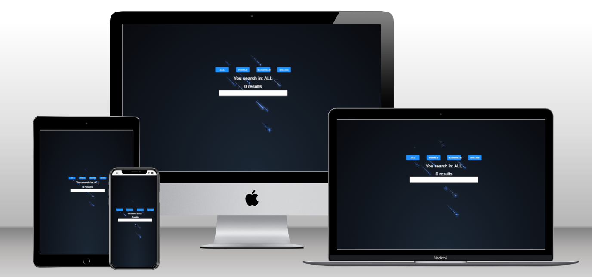

# Kruger Star WeatherApp

> Proyecto WeatherApp

## Built with 

- JavaScript 
- React.js **18**
- Vercel
- HTML + CSS
- [Weather Api](https://www.weatherapi.com/)
- [Unsplash Api](https://unsplash.com/developers)

## Live Demo

[live demo link](https://weather-ks.vercel.app/)

## Run it
 ### Setup
 - Clone this repo using `git clone --branch WeatherApp https://github.com/KevinVeliz/Proyects-KS`
 ### Commands
 - `npm i` 
 - `npm start`
## Author
👤 **Kevin Veliz**
- GitHub: [@KevinVeliz](https://github.com/KevinVeliz)
- LinkedIn: [Kevin Veliz](https://www.linkedin.com/in/kevin-veliz-b747a0206/)
## 🤝 Contributing
- Juan Sotomayor - Tutor Kruger Star

## Show your support
Give a ⭐ if you like this project!
## Acknowledgments
- Desing by: JS

## 📝 License
This project is [MIT](./MIT.md) licensed.
